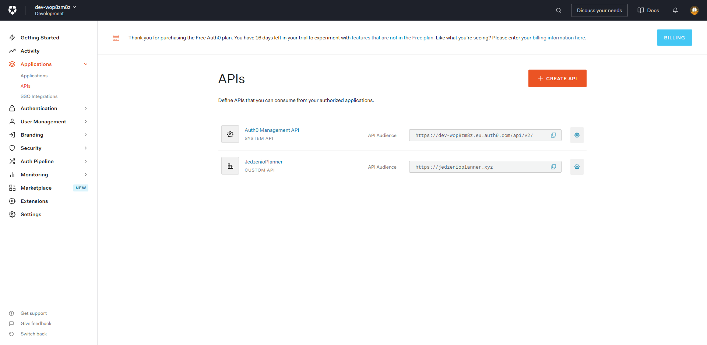
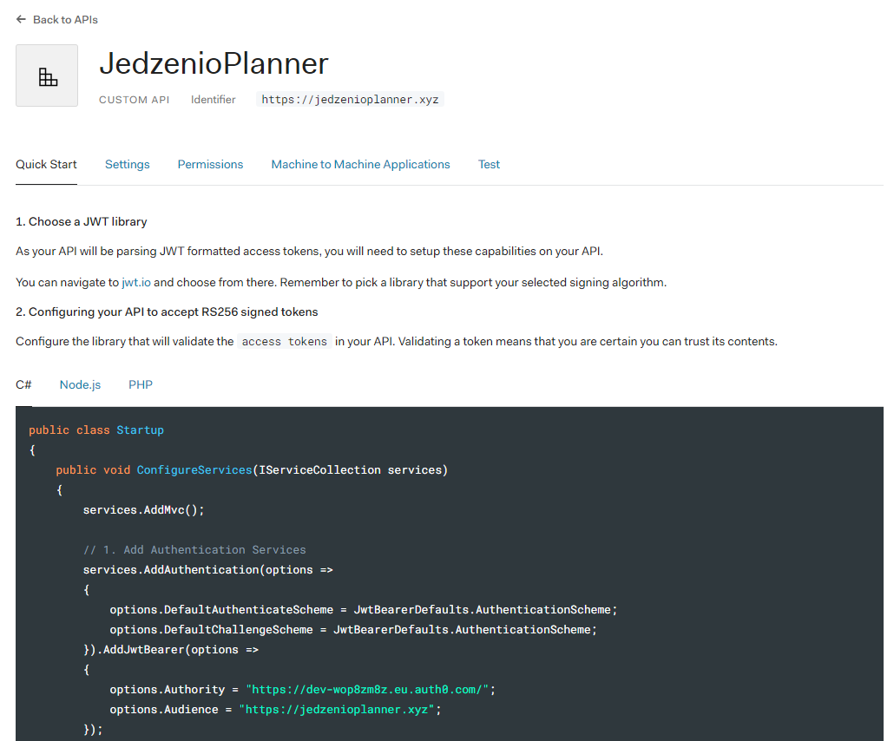
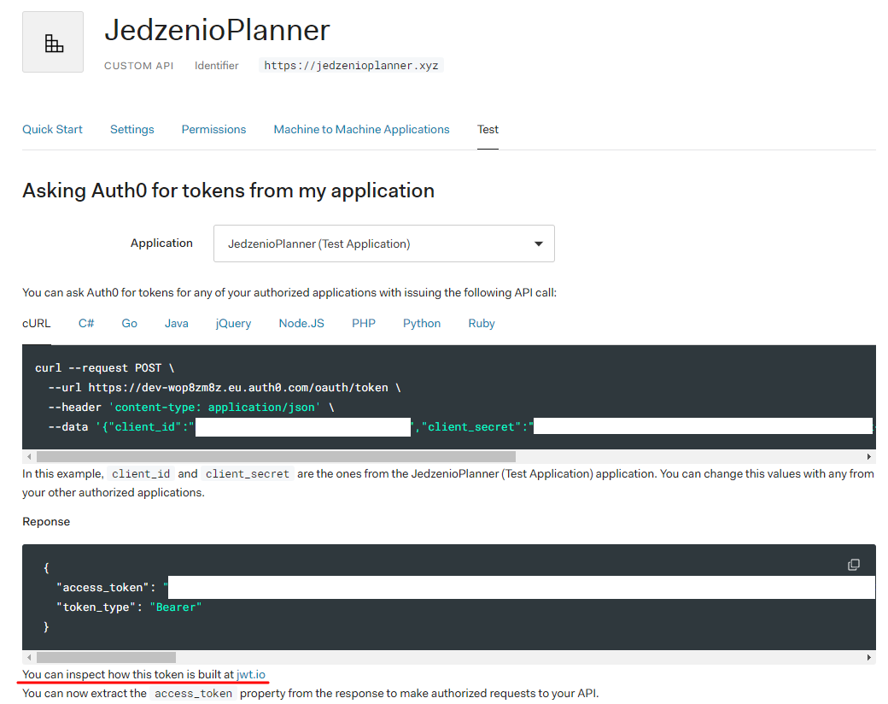
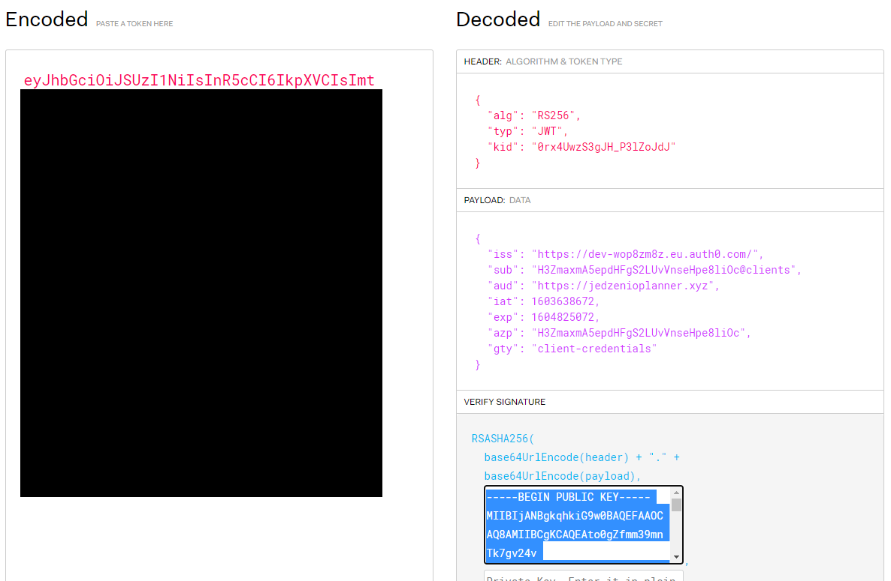
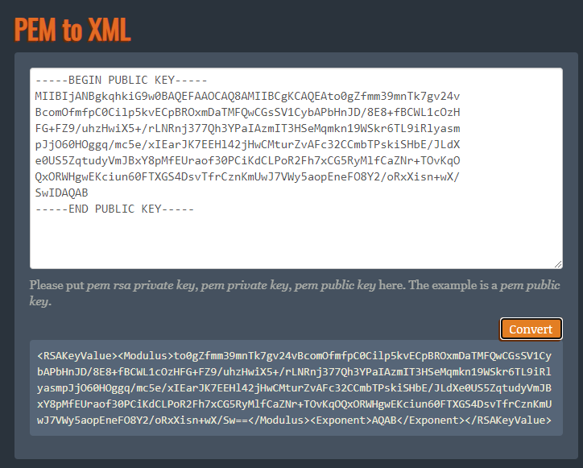

# JedzenioPlanner.Api

# Jak uruchomić aplikację? 

## Auth0

Aplikacja wykorzystuje Auth0 do autentykacji. Aby umożliwić aplikacji działanie, należy: 
- zarejestrować się w [Auth0](https://manage.auth0.com/) i utworzyć nowy projekt
- utworzyć nowe API

- skopiować wartości Audience i Authority, który znajdują się w zakładce 'Quick Start' w nowo utworzonym API

- przejdź do zakładki Test, kliknij na link `You can inspect how this token is built at jwt.io`

- w jwt.io skopiuj Public Key i przekonwertuj go na format XML [tutaj](https://superdry.apphb.com/tools/online-rsa-key-converter)

- klucz w formacie xml zapisz jako rsa.xml (ten plik będzie potrzebny później)

## Kompilacja z kodu źródłowego

- Pobierz kod źródłowy aplikacji z GitHuba (git clone https://github.com/JedzenioPlanner/JedzenioPlanner.Api) lub w formie pliku [zip](https://github.com/JedzenioPlanner/JedzenioPlanner.Api/archive/main.zip)
- utwórz pusty folder `datastore` w ścieżce `src/JedzenioPlanner.Api` (będą tam znajdowały się zdjęcia dołączone do utworzonych przepisów)
- skopiuj plik `rsa.xml` do lokalizacji `src/JedzenioPlanner.Api`
- dostosuj wartości Audience i Authority w pliku appsettings.json (`src/JedzenioPlanner.Api/appsettings.json`)
- z poziomu folderu repozytorium uruchom komendę `./build.cmd dbupdate` lub `./build.sh dbupdate` w zależności od systemu operacyjnego
- z poziomu folderu `./src/JedzenioPlanner.Api` uruchom komendę `dotnet run`